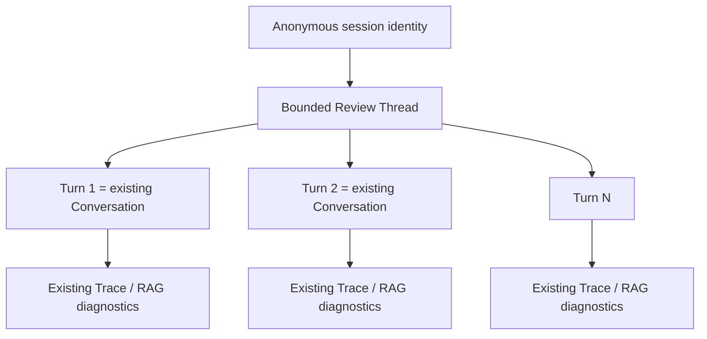

# Conversation Review Product/UI Contract — 2026-09-18

Authoritative Role A product/UI contract for GitHub Issues #68 and #87, corrected against the real current Conversation Review UI supplied by Product Owner on 2026-09-17.

This revision **SUPERSEDES** the 2026-09-17 layout proposal. Product semantics that are not explicitly changed remain valid. Engineering HOW remains open unless explicitly stated.

---

# Current UI Baseline

The existing Admin → Conversation Review surface is a high-density compact review list, not a conventional data table and not a multi-pane observability workspace.

Frozen baseline characteristics:
- existing left navigation and page hierarchy remain;
- page header + bulk Intent action remain;
- existing search/filter row remains the primary filtering surface;
- existing quick-filter chips remain;
- each result remains a compact conversation card/row;
- right-side confidence / answer state / latency treatment remains;
- existing single-turn detail/Trace workflow remains available.

**Hard UI principle: progressive enhancement. Do not redesign Conversation Review.**

---

# Issue #68 — Country/Region + Entry Channel

## Status

- Type: Feature
- Product contract: FROZEN
- UI contract: FROZEN against current UI baseline
- Engineering implementation: READY AFTER fresh baseline/drift review

## Goal

Expose authoritative visitor Country/Region and authoritative Entry Channel without reducing the scan density of the existing Conversation Review list. Both dimensions must be filterable server-side across the complete result set.

## Repository baseline audit — 2026-09-18

Role A inspected current `main` before re-authorizing this feature.

Confirmed existing support:
- `Conversation.country` already exists in PostgreSQL as `String(10)`;
- `Conversation.session_id` and `Conversation.site_id` already exist and are indexed;
- the current `channel` field is transport semantics. The Admin UI explicitly offers `widget` / `discord`, so it is **not** Entry Channel;
- the current Conversation Review list/detail API does **not** expose `country`, `site_id`, or `session_id`;
- the current Admin list API has no Country or Entry/site filter.

Critical defect in existing country capture:
- current `/api/ask` derives `Conversation.country` from the region suffix of `Accept-Language` (for example `en-US → US`);
- this is language/locale inference, not geographic truth, and directly violates this Product Contract;
- therefore the repository has a **country storage field but does not currently have acceptable country-detection functionality**.

### Required capability addition

Issue #68 therefore includes backend country-truth implementation, not only Admin presentation.

Required behavior:
1. Replace `Accept-Language`-derived country assignment with one authoritative request-country resolver.
2. Resolver output is ISO 3166-1 alpha-2 or `UNKNOWN`/NULL.
3. A deployment must be able to obtain country from a trusted server-side source:
   - trusted ingress/edge country metadata, **or**
   - trusted server-side IP geolocation;
   exact provider/library is Engineering HOW, but client-spoofable arbitrary headers are not authority.
4. The trust boundary must be explicit. Forwarded geo/IP metadata is accepted only from configured trusted ingress/proxy paths.
5. Raw IP must not be exposed in Admin and must not be newly retained merely for this feature.
6. Country resolution failure is fail-honest: persist/display Unknown rather than infer from language.
7. Existing historical country values produced by the old `Accept-Language` heuristic must **not** be presented as authoritative geography. Migration/provenance strategy must classify them as legacy-untrusted or convert them to Unknown; silently grandfathering them as factual Country is forbidden.
8. New country truth must carry sufficient provenance/audit semantics to distinguish trusted geo from Unknown/legacy-untrusted data. Exact schema (`country_source`, migration marker, or equivalent) is Engineering HOW.
9. Add the appropriate query/index support so Country filtering is server-side and remains operational at Conversation Review scale.
10. Add regression tests proving `Accept-Language` cannot determine Country.

### Entry Channel baseline result

The current `channel` field is confirmed to be transport semantics. Therefore #68 requires a **separate Entry dimension backed by `site_id` / authoritative site configuration**.

Admin API requirements:
- list response exposes Country truth and Entry/site display projection;
- detail response exposes the same values;
- list endpoint accepts Country and Entry/site filters before pagination;
- transport `channel` filter remains independently available;
- no URL/domain guessing is allowed.

## Truth model

### Country/Region

Canonical persisted value: ISO 3166-1 alpha-2 country code plus `UNKNOWN`.

Authority order:
1. trusted server/edge geo signal captured at request ingress, when explicitly configured and trusted;
2. trusted server-side IP geolocation resolution, when explicitly configured;
3. otherwise `UNKNOWN`.

Hard rules:
- `Accept-Language`, locale, timezone and UI language MUST NOT infer country;
- raw visitor IP is not required by this feature and must not be exposed in Admin UI;
- historical rows may be backfilled only from already-persisted authoritative geo truth; otherwise `UNKNOWN`.

### Entry Channel

Entry Channel means the user-facing ASK-AI entry surface, not transport semantics.

Canonical authority:
- persisted `site_id` / site identity bound at conversation creation;
- resolved through authoritative site configuration to a stable display label such as Website / Wiki / Store.

Hard rules:
- existing transport/channel semantics such as `widget`, WhatsApp or Discord remain distinct;
- URL/domain substring guessing is forbidden;
- no authoritative site identity => `UNKNOWN`.

### Existing “Channel” filter compatibility gate

The current real UI already contains an **“All Channels / 全部渠道”** filter. Before implementation, B must trace its exact backend semantic.

- If it is transport/access technology, preserve it and name the new dimension unambiguously as **Entry / 访问入口**.
- If it already represents authoritative site/entry identity, extend/reuse it rather than creating a duplicate filter.
- No implementation may ship two visually different filters with the same semantic.

This is a required baseline investigation, not permission to reinterpret Product semantics.

## API/filter semantics

- Country and Entry filters execute server-side before pagination.
- Total count and pagination reflect the filtered result set.
- Filters compose with existing search/channel/intent/status/feedback filters.
- `UNKNOWN` is first-class and filterable.
- no client-page-only filtering.

## Frozen UI direction

Do **not** convert the current card list into a table and do **not** add permanent table-style columns.

Extend the existing metadata line of each compact result card.

Example:

```text
envios a argentina ?
ID 01a0aec1…e048   商务咨询   Argentina   官网
                                      置信 85%   已回答
                                      7,9xxms
```

The exact wrapping adapts to available width, but the current question-first hierarchy remains.

Top filter row is extended in the current visual language:

```text
[搜索问题/回答…] [接入方式/现有渠道] [访问入口] [国家/地区] [全部意图] [全部状态] [全部反馈]
```

If the compatibility audit proves the existing Channel filter already equals Entry, reuse it and omit the extra Entry filter.

## Responsive behavior

- desktop: Country/Region and Entry are compact metadata, not new table columns;
- narrow width: secondary metadata may wrap/collapse into card metadata; filters remain reachable;
- long labels truncate safely with full value available in detail/accessible title;
- Unknown is neutral, not an error state;
- do not reduce visibility of question, intent, confidence, answer status or latency.

## Acceptance

1. Existing Conversation Review visual hierarchy and compact-card density are preserved.
2. Country/Region and Entry are visible from authoritative backend values without converting the list to a table.
3. Detail exposes the same authoritative values.
4. Existing Channel semantic is confirmed as transport (`widget` / `discord`) and remains distinct; Entry is a separate site-backed dimension.
5. Country and Entry filters are server-side and operate before pagination.
6. Filtered totals/pagination are correct and filters compose with existing filters.
7. Unknown is explicit and filterable.
8. No country inference from language/locale/timezone.
9. No Entry inference from URL text or transport channel.
10. No raw IP exposure or unnecessary new PII.
11. Historical missing truth remains Unknown unless authoritative persisted backfill exists.
12. Existing Conversation ID/status/intent/confidence/answer-state/latency semantics remain unchanged.
13. Regression tests cover trusted country resolution, rejection of Accept-Language inference, legacy-untrusted country handling, Unknown, transport-vs-Entry separation, filtering, pagination/counts and old/new rows.
14. Production-like acceptance demonstrates at least one trusted-country path yields the correct ISO country and an unavailable/untrusted path yields Unknown.
15. Visual acceptance is performed against the real current Conversation Review baseline, not the superseded table mock.

## Non-goals

- redesigning Conversation Review;
- table conversion;
- customer identity resolution;
- attribution/campaign analytics;
- raw IP display;
- URL-derived channel heuristics.

---

# Issue #87 — Conversation Thread Review

## Status

- Type: Feature
- Product contract: FROZEN
- UI/IA contract: FROZEN against current UI baseline
- Engineering implementation: READY AFTER fresh baseline/drift review

## Goal

Add bounded multi-turn review while preserving the current high-density single-turn Conversation Review experience.

## Canonical hierarchy



## Thread boundary semantics

A Thread requires:
1. same authoritative anonymous `session_id`;
2. same authoritative site/Entry identity when present;
3. compatible transport identity;
4. inactivity gap <= 30 minutes;
5. no explicit new-conversation/reset boundary.

Split when:
- gap > 30 minutes;
- explicit reset/new conversation;
- site/Entry identity changes;
- transport identity changes where semantics are incompatible.

Midnight alone does not split within the inactivity window.

`session_id` is anonymous browser/session identity, not person/customer identity. No cross-device joining, LLM/embedding identity guessing or semantic clustering.

Historical rows without reliable session identity remain honest singleton/unthreaded legacy records.

## Aggregation / pagination

- Thread aggregation occurs server-side before pagination.
- Page-local `groupBy(session_id)` is forbidden.
- Thread counts represent bounded Threads, not Turns.
- a matching Turn may promote its containing Thread into Thread-mode search results;
- filters operate on complete Thread results.

## Frozen UI information architecture

Conversation Review remains one product surface and gains a lightweight mode switch:

```text
对话审查        [ 单轮 | 会话 ]
```

### 单轮 / Turns

**Preserve the current page behavior and visual structure.** No redesign is authorized.

### 会话 / Threads

Use the same compact list/card visual language as current Conversation Review.

Example:

```text
如何配置 NeoMind webhook
ID thread_xxx   技术支持   官网                    4轮
                                              最近 10:31
                                              有异常

NeoMind 首次使用如何配网激活
ID thread_yyy   产品咨询   Wiki                    3轮
                                              最近 10:24
                                              正常
```

Minimum Thread card projection:
- stable/short Thread identity;
- first/representative question;
- Turn count;
- start/last activity or concise time range;
- authoritative Entry/site where available;
- Country/Region where stable and authoritative;
- existing truthful review/failure signal where derivable.

No LLM-generated topic/title, automatic resolved judgment, inferred customer identity or new quality score.

## Thread detail

Clicking a Thread navigates to/opens a **transcript-first detail**, rather than rendering a permanent three-pane workspace.

```text
← 返回对话审查

NeoMind webhook 配置
4轮 · 10:21–10:31 · 官网 · 技术支持

用户
NeoMind 如何配置推送 webhook

ASK-AI
...

用户
签名怎么验证？

ASK-AI
...

[select/open a Turn]
        ↓
existing Turn / Trace / RAG diagnostics
```

A selected Turn reaches/reuses the existing diagnostic surface. Do not duplicate or redefine Trace semantics.

## Explicitly rejected UI direction

The previous default:

```text
Thread List | Transcript | Turn/Trace
```

three-column workspace is **REVOKED**.

Reason: it reduces information density and conflicts with the actual current Conversation Review interaction model.

Wide screens may use an existing drawer/detail affordance for diagnostics if already established by the product, but implementation must not introduce a new permanent three-pane IA under this Issue.

## Responsive behavior

- existing single-turn page remains unchanged;
- Thread list uses the same responsive list/card language;
- Thread detail stacks naturally;
- narrow/mobile follows `Thread List → Transcript → Turn/Trace`;
- back navigation preserves mode, filters and list position where practical.

## Acceptance

1. Conversation Review exposes distinct Single-turn/单轮 and Thread/会话 modes.
2. Single-turn mode preserves the current UI and behavior; no redesign regression.
3. Thread list uses the current compact-card visual language, not a new table or three-pane workspace.
4. Thread construction follows deterministic boundary rules.
5. >30-minute gap, explicit reset, site/Entry change and incompatible transport split Threads correctly.
6. Midnight alone does not split within the inactivity window.
7. Historical unreliable identities are not guessed into Threads.
8. Aggregation/pagination/search/filtering occur server-side over complete Thread results.
9. Thread detail is transcript-first and chronologically complete.
10. Each Turn retains its existing Conversation ID and can reach existing Trace/RAG diagnostics.
11. Back navigation preserves review context where practical.
12. No generated summary replaces the transcript.
13. Regression tests cover boundaries, pagination, search promotion, legacy rows, site/channel split and Turn→Trace linkage.
14. Visual acceptance is performed against the real current Conversation Review baseline supplied by Product Owner.

## Non-goals

- redesigning the existing single-turn review page;
- permanent three-pane observability workspace;
- customer/person identity resolution;
- cross-device merge;
- LLM topic segmentation;
- semantic clustering as Thread boundary;
- automatic resolution scoring;
- replacing existing Trace diagnostics.

---

# Issue #48 — Citation Linkability UI State Reference

No change. #48 remains a local Widget citation-state bug; it does not redesign Admin Conversation Review.

| State | Clickable | Presentation | Navigation |
|---|---:|---|---|
| valid | yes | normal citation treatment | canonical external destination |
| no_destination | no | neutral unavailable/no-link label | none |
| private | no | restricted/private label | none |
| stale | no | stale/unavailable label | none |
| malformed/error/unsafe | no | unavailable/error label | none |

Only `valid` enters link tab order. No empty href, self-navigation, `file://`, or fabricated public link.

---

# Role A Gate

This 2026-09-18 revision supersedes the 2026-09-17 UI layout proposal.

Role B may choose implementation HOW only inside these semantics and boundaries. A fresh repository baseline/drift review is required before implementation authorization.

Material changes to truth authority, Thread boundaries, privacy semantics, existing Channel semantics, or the current Conversation Review visual hierarchy require Role A re-freeze.
