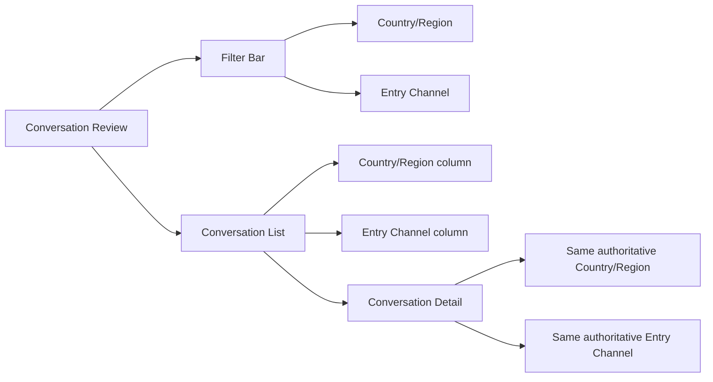
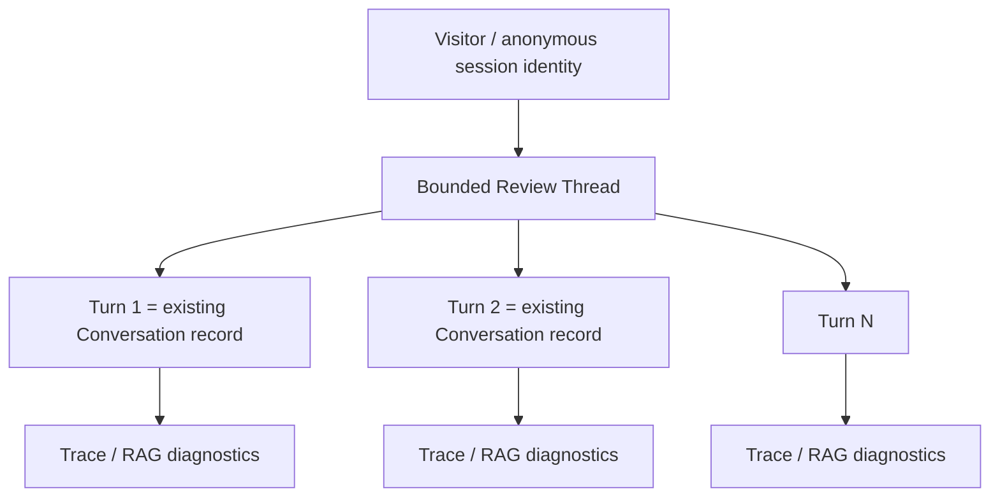
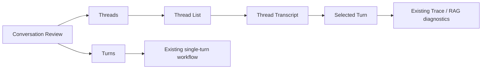

# Conversation Review Product/UI Contract — 2026-09-17

Authoritative Role A product/UI contract for GitHub Issues #68 and #87. This file freezes product semantics, IA, interaction boundaries, and acceptance. Engineering HOW remains open unless explicitly stated.

---

# Issue #68 — Country/Region + Entry Channel

## Status

- Type: Feature
- Product contract: FROZEN
- UI contract: FROZEN
- Engineering implementation: READY AFTER fresh baseline/drift review

## Goal

Conversation Review must expose authoritative visitor Country/Region and authoritative Entry Channel in both list and detail views, with server-side filtering across the complete result set.

## Truth model

### Country/Region

Canonical persisted value: ISO 3166-1 alpha-2 country code plus `UNKNOWN`.

Authority order:
1. trusted server/edge geo signal captured at request ingress, when explicitly configured and trusted;
2. trusted server-side IP geolocation resolution, when explicitly configured;
3. otherwise `UNKNOWN`.

Hard rules:
- `Accept-Language` MUST NOT be used to infer country;
- browser locale, timezone, UI language, hostname text, and free-form URL text are not geographic authority;
- raw visitor IP is not required by this feature and must not be exposed in Admin UI;
- if implementation uses IP transiently for geo resolution, persistence/retention is governed separately and must not be expanded by this feature;
- historical rows may be backfilled only from an already persisted authoritative geo value. Otherwise they remain `UNKNOWN`.

### Entry Channel

Entry Channel means the user-facing ASK-AI entry surface, not transport semantics.

Canonical authority:
- persisted `site_id` / site identity that is bound to the request/session at conversation creation;
- resolved through the authoritative site configuration into a stable entry-channel identity and display label.

Examples of display labels may include Wiki, Website, Store, but the underlying key must be stable site identity, not URL-pattern inference.

Hard rules:
- `channel=widget` remains transport/channel semantics and MUST NOT be relabeled as Website/Wiki/Store;
- URL substring/domain guessing is forbidden;
- when no authoritative site identity exists, Entry Channel = `UNKNOWN`;
- if authoritative site identity changes between turns, that is a real boundary and must be preserved rather than hidden by presentation grouping.

## API/filter semantics

- Country and Entry Channel filters execute server-side before pagination.
- Total count and pagination reflect the filtered result set.
- Filters compose with existing Conversation Review filters.
- `UNKNOWN` is a first-class filter option.
- list and detail read the same authoritative projection.
- no client-page-only filtering is acceptable.

## UI information architecture



## Desktop wireframe

```text
Conversation Review
┌────────────────────────────────────────────────────────────────────────────┐
│ Search ...       Country/Region [All ▼]   Entry Channel [All ▼]   Reset  │
├────────────────────────────────────────────────────────────────────────────┤
│ Time │ Country/Region │ Entry Channel │ User │ Question │ Status │ ...    │
│ ...  │ US             │ Website       │ ...  │ ...      │ ...    │        │
│ ...  │ Unknown        │ Wiki          │ ...  │ ...      │ ...    │        │
└────────────────────────────────────────────────────────────────────────────┘
```

## Responsive behavior

- desktop/tablet: both columns remain directly scannable when space permits;
- narrow layout: secondary columns may collapse into row detail/metadata, but both filters remain reachable;
- long labels truncate visually and expose full value via accessible title/detail;
- Unknown uses neutral visual treatment and is not styled as an error.

## Acceptance

1. List shows Country/Region and Entry Channel from authoritative backend values.
2. Detail shows the exact same authoritative values.
3. Both dimensions support server-side filtering over the full result set.
4. Filtered pagination/counts are correct.
5. Unknown is explicit and filterable.
6. No country inference from language/locale/timezone.
7. No Entry Channel inference from URL text or transport channel.
8. No raw IP exposure; no unnecessary new PII surface.
9. Historical missing truth remains Unknown unless authoritative persisted backfill exists.
10. Existing Conversation ID/status/transport-channel semantics remain distinct.
11. Responsive layout preserves access to both filters and values.
12. Regression tests cover authority, Unknown, server filtering, pagination/counts, and old/new rows.

## Non-goals

- customer identity resolution;
- attribution analytics dashboard;
- campaign/UTM analytics;
- raw IP display;
- URL-derived channel heuristics;
- rewriting historical Unknown values from guesses.

---

# Issue #87 — Conversation Thread Review

## Status

- Type: Feature
- Product contract: FROZEN
- UI/IA contract: FROZEN
- Engineering implementation: READY AFTER fresh baseline/drift review

## Goal

Add continuous conversation review on top of existing single-turn diagnostics so reviewers can inspect a bounded multi-turn consultation without losing the current Turn/Trace debugging model.

## Canonical hierarchy



Existing Conversation records remain the Turn truth. This feature adds a thread-level read model; it does not redefine Trace semantics.

## Thread boundary semantics

A Thread is deterministic and bounded by all of the following:

1. same authoritative anonymous `session_id`;
2. same authoritative site/Entry Channel identity when present;
3. same transport channel where transport semantics materially differ;
4. inactivity gap <= 30 minutes;
5. no explicit new-conversation/reset boundary.

Split rules:
- inactivity gap > 30 minutes => new Thread;
- explicit new-conversation/reset => new Thread immediately;
- site/Entry Channel change => new Thread;
- transport-channel change => new Thread when identity semantics differ;
- crossing midnight alone does NOT split if the gap remains <= 30 minutes.

Identity rules:
- `session_id` is anonymous browser/session identity, not customer/person identity;
- no cross-device joining;
- no embedding similarity, LLM inference, email/name guessing, or semantic clustering for Thread identity;
- historical rows without reliable session identity are shown as unthreaded/singleton legacy items, never guessed into another Thread.

## Stable thread identity

The read model must expose a deterministic `thread_id` stable for an unchanged underlying bounded segment. Engineering may persist it or derive it deterministically, but pagination/filtering must operate on that server-side thread identity rather than client grouping.

## Aggregation/pagination semantics

- Thread aggregation occurs server-side BEFORE pagination.
- Page-local `groupBy(session_id)` is forbidden.
- Thread counts represent real bounded Threads, not Turns.
- A Turn-level search match promotes its containing Thread into results.
- Search result metadata should identify the matched Turn(s) where practical.
- filters are applied using authoritative thread-stable dimensions; values that would violate stability (for example site change) already split the Thread.

## Conversation Review IA



`Turns` preserves the existing review surface. `Threads` becomes the continuous-consultation view.

## Thread list minimum projection

Each Thread row must include:
- deterministic Thread ID or short display identity;
- first/representative question;
- Turn count;
- start time and last activity/time range;
- authoritative site/Entry Channel when available;
- Country/Region when stable/authoritative;
- existing truthful review/failure signal where already available.

Do NOT add in this scope:
- LLM-generated topic/title as authority;
- automatic “resolved” judgment;
- inferred customer identity;
- sentiment or quality scoring unless already governed elsewhere.

## Desktop wireframe

```text
Conversation Review
[ Threads ] [ Turns ]

┌───────────────────────┬─────────────────────────────┬──────────────────────┐
│ Threads               │ Transcript                  │ Turn / Trace         │
│ Search / Filters      │ Thread T-10234             │ Turn 3               │
│                       │                             │                      │
│ T-10234  8 turns      │ 14:20 User                 │ Retrieval            │
│ pricing question      │ Q1 ...                      │ Rerank               │
│ last 14:31            │ 14:20 Assistant            │ Evidence             │
│                       │ A1 ...                      │ Citation             │
│ T-10233  3 turns      │ 14:24 User                 │ Reasoning/response   │
│ ...                   │ Q2 ... [View Trace]         │ Existing diagnostics │
└───────────────────────┴─────────────────────────────┴──────────────────────┘
```

## Responsive behavior

- wide desktop: coordinated three-level layout is preferred;
- medium width: Thread list + Transcript, with Trace in drawer/detail route;
- narrow/mobile: stack as `Thread List → Transcript → Turn/Trace`; do not squeeze three panes horizontally;
- back navigation preserves current selection/filter state.

## Transcript behavior

- strict chronological Turn order;
- User and Assistant are visually distinct;
- each Turn retains its existing Conversation ID for diagnostics;
- Turn drill-down opens/reveals existing Trace data rather than duplicating it;
- no generated summary may replace the actual transcript.

## Acceptance

1. Threads and Turns are distinct modes; existing Turn review remains available.
2. Thread construction follows the deterministic boundary rules above.
3. Same session with >30-minute gap is split.
4. Same session with explicit reset is split.
5. Site/Entry Channel change splits.
6. Midnight alone does not split within the inactivity window.
7. Historical rows without reliable session identity are not guessed into Threads.
8. Thread aggregation and pagination are server-side and deterministic.
9. Search/filter operates on complete Thread results, not current-page grouping.
10. Transcript shows complete chronological Turns for the selected Thread.
11. Any selected Turn can reach the existing Trace/RAG diagnostics.
12. Current single-turn diagnostics and Conversation IDs remain unchanged.
13. Desktop and narrow viewport behavior follows the frozen IA.
14. Regression tests cover boundary splitting, pagination, search promotion, legacy rows, site/channel split, and Turn→Trace linkage.

## Non-goals

- customer/person identity resolution;
- cross-device merge;
- LLM topic segmentation;
- semantic clustering as primary boundary;
- auto-resolution scoring;
- replacing existing Trace diagnostics;
- deleting/redefining existing Conversation records.

---

# Issue #48 — Citation Linkability UI State Reference

This file also records the compact visual state reference already frozen in Issue #48. It does not expand #48 scope.

| State | Clickable | Presentation | Navigation |
|---|---:|---|---|
| valid | yes | normal citation treatment | canonical external destination |
| no_destination | no | neutral unavailable/no-link label | none |
| private | no | restricted/private label | none |
| stale | no | stale/unavailable label | none |
| malformed/error/unsafe | no | unavailable/error label | none |

```text
[1] System Configuration Guide                 [Valid]      ↗
[2] Internal Policy Document                  [No link]     —
[3] Private Resource                          [Private]     —
[4] Archived Guide                            [Stale]       —
```

Only `valid` enters link tab order. Non-clickable evidence remains visible when citation semantics permit. No empty href, self-navigation, file:// navigation, or fabricated public link.

---

# Role A Gate

The contracts above are authoritative product/UI truth for Issues #68 and #87 as of 2026-09-17.

Role B may choose implementation HOW only inside these semantics and boundaries. Fresh repository baseline/drift review is required before implementation authorization. Any material change to Thread boundary, authority source, privacy semantics, information hierarchy, or acceptance requires Role A re-freeze.
